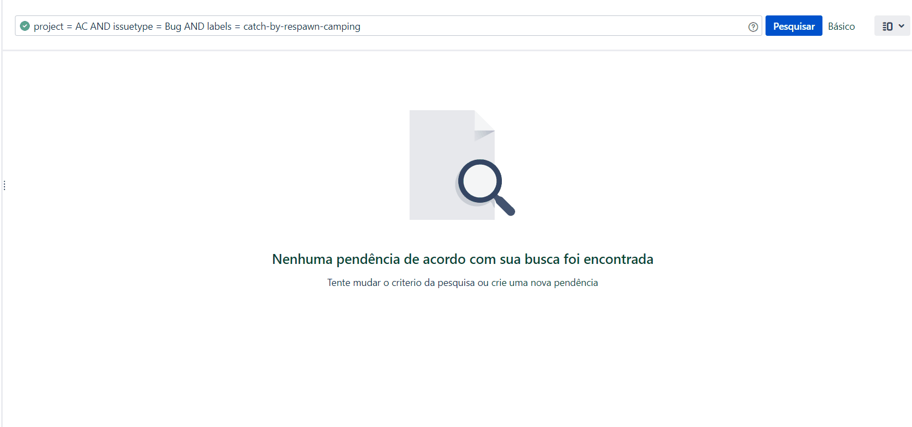

#Bug Respawn Camping
As a camper in fps game, this library will be camping in the software waiting the bug to respaw.
It will work for TypeScript / Angular applications.

[](https://badge.fury.io/js/bug-respawn-camping)
[](https://travis-ci.org/lordazzi/bug-respawn-camping)
[](https://github.com/lordazzi/bug-respawn-camping/blob/documentation/LICENSE)

> This tool is not sufficiently tested to be used in your production environment. We recommend that it be installed for approval only and that defects or notions of improvement be shared with us via issue or via pull request.

> This library will work only with Jira API v2

## Overview


## Installing
You can install this library as a typescript dependency of your angular project or typescript project (as well as any project that supports the installation of typescript libraries).

```npm install bug-respawn-camping@latest --save```

You can also just import the ```bug-respawn-camping.x.x.x.js``` in your browser javascript application (just make sure you can access the application from a cross origin).

```<script src="some/path/bug-respawn-camping.x.x.x.js"></script>```
```<script src="some/path/bug-respawn-camping.x.x.x.min.js"></script>```

## Configure

This is how you will configure the basic camper:

```typescript
const basicKey = btoa('jiraUserName@jiraUserPassword');
const handler = new HandlerBuilder()
  //  the project key you're treating in this application
  .setDefaultProjectKey('PRJ')

  //  the atlassian jira server of your company
  .setAtlassianJiraServer('http://jira.company.com/')

  //  The jira basic key is the more easy and insecure way to authenticate
  //  to a Jira Server. In future, Jira could depreciate this authentication
  //  way so, integration using oauth 2 is a pending of this library.
  //  The basicKey is generate from an Jira Access: username@password, encoded
  //  in base64.
  .basicAuth(basicKey)

  //  This will inform the library that the new issues registered should be
  //  displayed in Jira History
  .updateJiraHistoryOnIssueCreate()

  //  Here you declare each error normalizer.
  .declareCustomErrorNormalizer([
    CommonErrorNormalizer
  ])

  //  Use the definitions to build the error handler.
  .build();

addEventListener('error', event => handler.launch(event));
```

The ```CommonErrorNormalizer``` will treat simple types of bug, like: script error, run time exceptions and untreated promises. It does not come declared by default and you can choose do not use it.
The lib do not add it by default in the error event emitted from the window object to ensure the possibility of easy future integration with node environments, not coupling the software to an environment.

## Error Normalizer
You can customize programatically the concept of a bug, you do that using the
```CustomErrorNormalizer<T>``` interface.

```typescript
/**
 * Here we're creating a new custom error normalizer, I called that
 * "ApiErrorNormalizer".
 * The generic type in CustomErrorNormalizer<T> represents the data
 * type that you want to convert to an jira issue.
 */
export class ApiErrorNormalizer implements CustomErrorNormalizer<XMLHttpRequest> {

  /**
   * Your custom error normalizes must have a unique name.
   * This will be includes in the error single id.
   */
  name = 'api-error';

  /**
   * The type check is a type guard function of typescript, it will check
   * if the given data is compatible with the expecting data. If it is,
   * the normalize method will me called and if it return a normalized
   * error, it will be registered in Jira.
   */
  typeCheck(possibleFailedXhr: unknown): possibleFailedXhr is XMLHttpRequest {
    if (possibleFailedXhr instanceof XMLHttpRequest) { // is an xhr instance?
      const statusLevel = Math.floor(possibleFailedXhr.status / 100);
      if ([4, 5].includes(statusLevel)) { //  is a bad request?
        return true;
      }
    }

    return false;
  }

  normalize(badXhr: XMLHttpRequest): ErrorNormalized | null {
    //  Here goes some code converting the XMLHttpRequest content data
    //  to an ErrorNormalized structure.
    //  If you did not find enough data to register the defect, or could
    //  not generate a unique id, you must return null and the error will
    //  be not registred.
  }
}
```

### The ErrorNormalized structure

The ```ErrorNormalized``` is an TypeScript interface with fields to represent an
issue in Jira.

```typescript
export interface ErrorNormalized {

  /**
   * Each error must have a single id. A way to identify that the occurrence
   * has already been registered.
   * It is better that errors are not registred because there is a very embracing
   * id than to create a too generic id and end up making the software to register
   * too many defects, being all the same defect.
   * The id will be a label in Jira and it will be used by the library in JQL searchs.
   */
  id: string;

  /**
   * Summary in Jira
   */
  title: string;

  /**
   * Description in Jira
   */
  content: string;

  /**
   * Aditional labels
   */
  labels: string[];
}
```

### JavaScript

If you're working on a JavaScript structure, you must create the same structure,
but using function as prototypes instead typescript classes, as you can see:

```javascript
function StringThrownErrorNormalizer() {
  this.name = 'logical-error';

  this.typeCheck = (possibleStructure) => {
    return typeof possibleStructure === 'string';
  };

  this.normalize = (stringThrown) => {
    return {
      id: 'string-thrown',
      title: 'String was thrown',
      content: `I do know why, but some one thrown a string in the software, here is the content: "${stringThrown}"`,
      labels: [ ]
    };
  };
}
```

## Other forms of use
The main point of use of this library is for errors thrown in the body of the application, but the structure is expansible and allows its use to be extended for situations such as: error responses by the api used; api responding with the data in an unexpected format; no network or low network speed (registering later, of course); and even logical errors as a form of defensive programming: Do you know those ifs that we don't put else because we imagine the situation will never occur? But if it occurs because of poorly software maintenance?

## Pendencies
1. The library need to implements the integration in Jira using Oauth 2.
2. The library need create a documentation about unit tests over new Error Normalizers.
3. The library need to implements way to stop Jira interaction in pre-configured dates and hours.
4. Create default classes to register no connection or low network speed
5. Upgrade TypeScript (to support strict mode and unknow type) version and unit test structure
